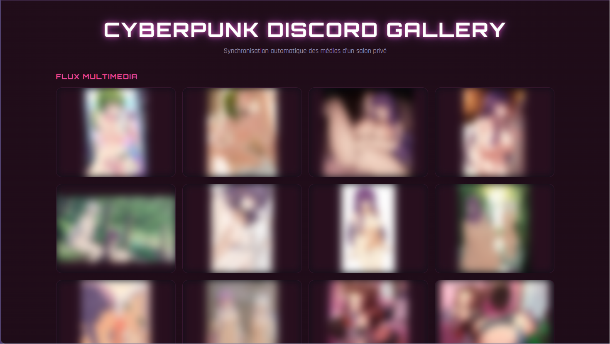
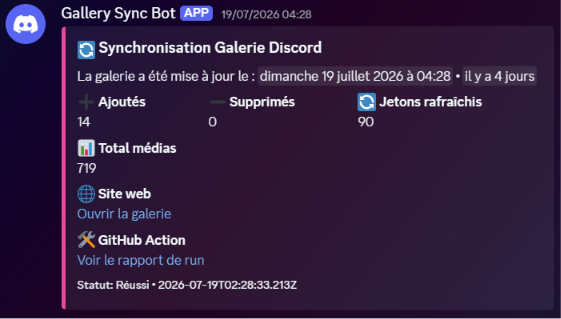
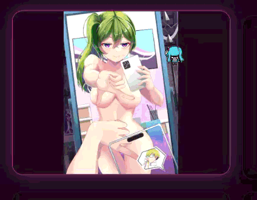

# PWA-Cyberpunk-Discord-Gallery

# [Projet Perso] J'ai créé une PWA "Cyberpunk Discord Gallery" qui synchronise automatiquement les médias d'un salon Discord — retours bienvenus !

# ⚠️ **NSFW — Ce post et les liens qu'il contient peuvent afficher du contenu réservé à un public adulte. Merci d'activer le tag NSFW sur le post et de ne cliquer sur les liens/captures que si vous êtes en mesure de voir ce type de contenu.** ⚠️

---
Salut à tous 👋

Depuis quelques mois je développe un petit projet perso que je voulais partager ici : une **galerie multimédia web au design cyberpunk**, qui se synchronise automatiquement avec un salon Discord.   

L'idée de base : centraliser et exposer joliment tous les médias postés dans un salon Discord, sous forme de site statique.

## 🧩 Comment ça fonctionne

**Back-end / Automatisation**
- Un script Node.js tourne **toutes les heures via GitHub Actions**  
- Il interroge l'API Discord, gère la pagination sur l'historique des messages  
- Il détecte et rafraîchit les jetons d'URL expirables des attachments Discord (CDN)  
- Un webhook envoie un petit récap à chaque synchro : médias ajoutés, supprimés, jetons rafraîchis

**Front-end**
- HTML/CSS/JS vanilla (pas de framework, volontairement)  
- Grille responsive qui s'adapte à toutes les tailles d'écran  
- Une lightbox modale pour agrandir les images/vidéos au clic  
- Le tout packagé en **PWA** (installable, icônes, manifest)

⚠️ NSFW  

## 🎨 Le design
J'ai voulu un thème cyberpunk assez marqué : néons roses/violets, typographie Orbitron/Rajdhani, effets de glow au survol des cartes.

⚠️ NSFW 

## 🛠️ Stack technique
- Node.js (script de synchro)  
- GitHub Actions (cron horaire + commit automatique)  
- API Discord (Bot token, lecture des messages/attachments)  
- Webhook Discord (notifications)  
- HTML / CSS / JS vanilla + Service Worker (PWA)

## 📂 Le code
Tout est open, voici les fichiers principaux si vous voulez jeter un œil ou vous en inspirer :
- [`index.html`](index.html)  — structure de la page  
- [`css/style.css`](css/style.css)  — thème cyberpunk  
- [`script.js`](script.js) — logique front-end (galerie + lightbox)  
- [`recupere_medias.js`](recupere_medias.js) — synchro Discord → JSON  
- [`.github/workflows/sync_discord.yml`](.github/workflows/sync_discord.yml) — workflow GitHub Actions  
- [`.env / .env.example`](.env.example) — Environnement secret

---

## ❓ Ce sur quoi j'aimerais votre avis
- **Sécurité des URLs Discord signées** : 
  Je committe le JSON généré (avec les URLs de pièces jointes) dans le repo;  
  Est-ce que vous voyez un souci à ça sur le long terme, ou une meilleure approche pour éviter d'exposer des jetons dans l'historique Git ?

- **Gestion du rate limiting Discord** : 
  Mon script ne gère pas encore les réponses 429 de l'API;  
  Quelqu'un a déjà eu ce problème sur des historiques volumineux ?

- **Accessibilité de la modale** : 
  Je sais que la gestion du focus clavier dans ma lightbox est perfectible;  
  Des retours d'expérience sur la meilleure façon d'implémenter un focus trap en vanilla JS ?

- **Architecture générale** : 
  Est-ce que l'approche "GitHub Actions + JSON statique" vous semble pertinente pour ce cas d'usage, ou verriez-vous une meilleure solution (webhook temps réel, base de données, etc.) ?

  
- Toute autre remarque, critique ou suggestion est la bienvenue, c'est un projet perso et j'apprends en le faisant !
Merci d'avance pour vos retours 🙏
